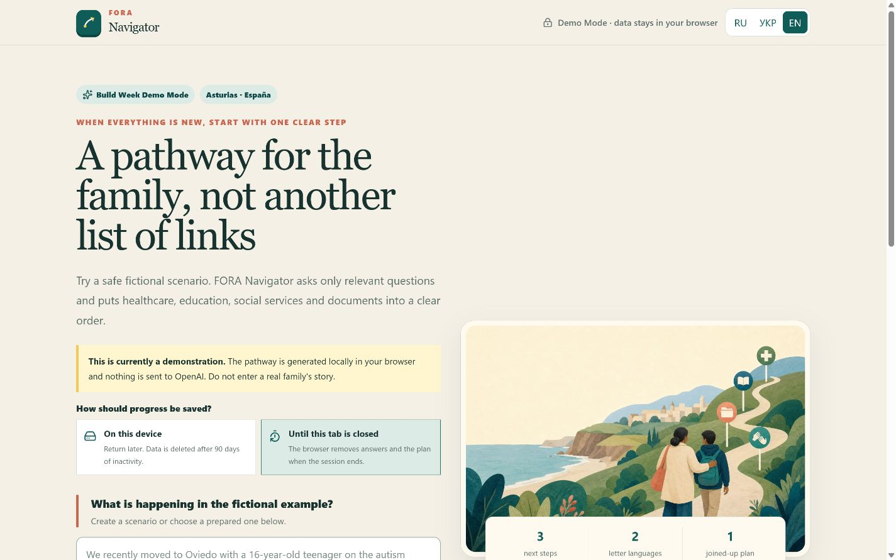
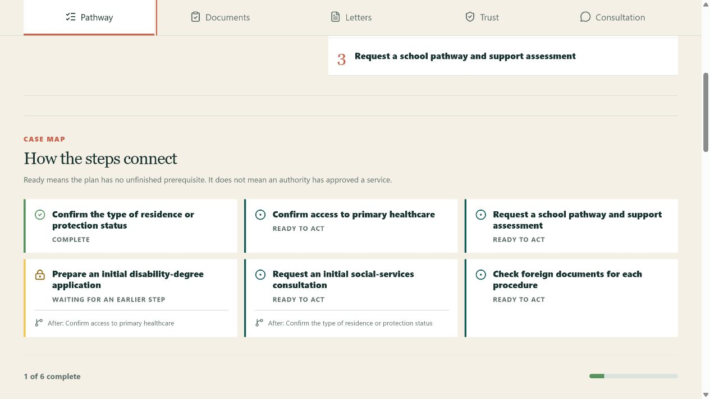
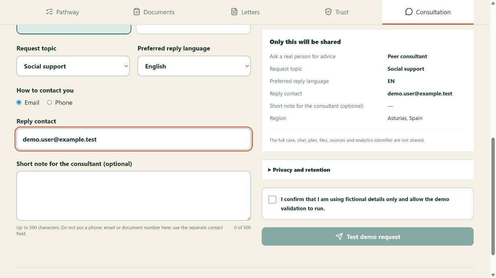
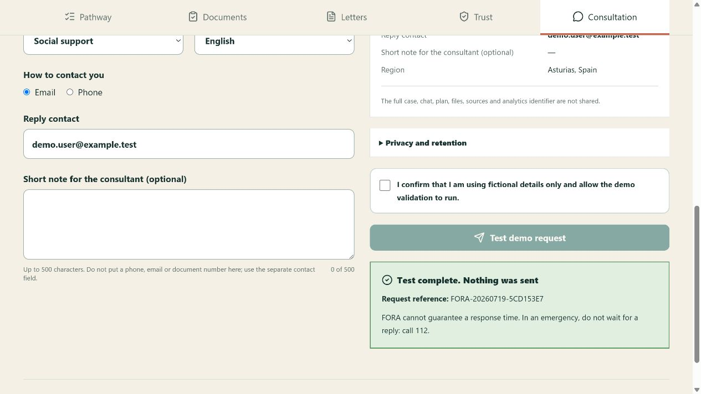

# FORA Navigator

**AI navigation for migrant families with disabilities.**

Competition Preview: [fora-navigator-source.vercel.app](https://fora-navigator-source.vercel.app)

Source repository: [github.com/ElenaBagaradnikova/fora-navigator](https://github.com/ElenaBagaradnikova/fora-navigator)

License: [MIT](./LICENSE)

## English overview for judges

FORA Navigator is a multilingual AI-assisted social-work navigator for migrant families supporting a child or young adult with a disability. The Build Week MVP focuses on Asturias, Spain, where healthcare, education, disability recognition, municipal support and migration or protection status often depend on one another. Instead of returning a long chatbot answer, the product turns a short intake into a prioritised pathway, a shared document checklist, editable message drafts and evidence cards whose claims can be checked.

The public preview works without an account or API key. Choose one of the three clearly fictional cases, switch the interface to English, complete or review the intake, select the safe local processing route and open the resulting plan. The plan exposes dependencies between actions, documents, responsible organisations, likely obstacles and expected outcomes. The consultation screen then demonstrates a separate human handoff to a peer consultant or specialist. It shows the exact minimal payload before consent; in the competition deployment it sends nothing and returns a labelled demo receipt.

### Judge quick start

1. Open the [live competition preview](https://fora-navigator-source.vercel.app).
2. Select `EN` and choose **Teenager, age 16**.
3. Continue with the pre-filled fictional answers and choose **Local processing** on the review screen.
4. Inspect **Plan**, **Documents**, **Letters**, **Trust** and **Consultation**.
5. For the handoff demo, use `demo.user@example.test`; the receipt will confirm that no message was sent.

### How Codex was used

Codex was the product and engineering partner throughout Build Week. It helped turn FORA's social-work domain experience into a bounded product specification and short, testable iterations; implement the multilingual interface and typed data contracts; design consent and data-minimisation boundaries; repair an obsolete official-source link; diagnose a production-only Turbopack/Zod initialization failure; and build the unit, integration, desktop and mobile test matrix. Product decisions—including audience, region, languages, controller identity, storage choices, consultation routes and the ban on real data in the public preview—remained with the project owner.

### How GPT-5.6 is used

GPT-5.6 Terra is implemented as an optional planner through the OpenAI Responses API with Structured Outputs. It receives a strictly validated, fictional Case only after a separate, short-lived consent. The response must satisfy a typed schema and then passes deterministic postflight checks for official-source metadata, action dependencies, documents, urgency, personal identifiers and prohibited guarantees. The live competition preview intentionally keeps this route behind a server-side feature flag and demonstrates the stable local path; the interface never labels a local fallback as a live model result.

### Safety and verification

Emergency screening runs before ordinary navigation. The product does not diagnose, prescribe, promise benefits or impersonate an authority. Draft letters are never sent automatically. Official sources show jurisdiction, confidence, last-reviewed date and next human-review date. Case data stays in the browser by default, and the consultation endpoint cannot access the full Case. The current verification matrix contains 59 unit/integration tests and 16 Playwright checks across desktop and mobile.

Submission materials: [YouTube demo](https://youtu.be/ArG4D22rc98) · [Devpost copy](./docs/DEVPOST.md) · [demo video script](./docs/DEMO_SCRIPT.md) · [submission checklist](./docs/SUBMISSION.md)

### Published preview









## Русская версия

FORA Navigator — конкурсный веб-MVP для русско-, украино- и англоязычных семей мигрантов и людей с защитным статусом в Asturias, Spain, которые сопровождают ребёнка или молодого взрослого с инвалидностью / особыми образовательными потребностями. Сервис превращает свободное описание ситуации в проверяемую дорожную карту, список документов и многоязычные черновики обращений.


## Что уже работает

- свободное описание ситуации и три полностью вымышленных демо-кейса;
- глобальный выбор языка `RU · УКР · EN` для интерфейса и навигационного ответа;
- 11 коротких уточняющих вопросов с локальным сохранением;
- документальные категории статуса: ЕС/ЕЭЗ/Швейцария, виза/резиденция, заявление на международную защиту, предоставленная защита, временная защита, отсутствие разрешения или неизвестный статус;
- детерминированный emergency gate до вызова модели;
- редактируемое резюме дела;
- маршрут «сейчас / 7 дней / месяц / позже»;
- документы, риски, ответственные, каналы и ожидаемые результаты для каждого шага;
- единый интерактивный чек-лист документов;
- письма RU/УКР/EN/ES без автоматической отправки;
- источники, юрисдикция, даты прошлой и следующей проверки, confidence и human verification;
- выбор хранения на устройстве с 90-дневным inactivity TTL или только до закрытия вкладки;
- выбор на экране проверки кейса: безопасный локальный маршрут по умолчанию или контролируемый маршрут через GPT-5.6 Terra;
- отдельное versioned-согласие для GPT-пути: действует 15 минут, привязано к `caseId`, хранится только в сессии и извлекается однократно;
- полностью локальная детерминированная генерация Demo Mode без сетевого AI-вызова и безопасный локальный fallback при ошибке API;
- реализованный live-AI путь закрыт server-side флагом `ENABLE_LIVE_AI=false` и разрешён только для полностью вымышленных данных;
- отдельный запрос живой консультации: равный консультант или специалист, точный preview, отдельное согласие, демо-квитанция и защищённый email-adapter;
- печать / сохранение плана в PDF средствами браузера;
- мобильная и клавиатурная доступность.

## Ограничение MVP

MVP знает только узкий сценарий Asturias (в первую очередь Oviedo): медицина, reconocimiento del grado de discapacidad, школьная навигация, базовые муниципальные социальные службы и подготовка иностранных документов.

Это информационный помощник, а не врач, юрист или орган власти. Он не ставит диагноз, не назначает лечение, не обещает выплату/статус/услугу и ничего не отправляет автоматически.

## Быстрый запуск

Требования: Node.js 20.9+ и pnpm 10+.

```bash
pnpm install
pnpm dev
```

Откройте [http://localhost:3000](http://localhost:3000).

Для локального Demo Mode `.env.local` не нужен: приложение полностью проходит основной демонстрационный сценарий без вызова OpenAI.

## Статус live AI

Контролируемый GPT-путь **реализован, но выключен по умолчанию**. Даже наличие `OPENAI_API_KEY` не включает его без отдельного server-side `ENABLE_LIVE_AI=true`. Текущая реализация предназначена только для вымышленных конкурсных кейсов; реальные данные и публичный live-пилот по-прежнему запрещены до privacy/legal review и отдельного эксплуатационного решения.

```dotenv
ENABLE_LIVE_AI=false
OPENAI_MODEL=gpt-5.6-terra
ENABLE_DEMO_FALLBACK=true
```

API Mode использует `gpt-5.6-terra`, Responses API `parse`, Zod Structured Outputs, `reasoning: medium`, тайм-аут 45 секунд и максимум 8 000 output tokens на попытку. Запрос выполняется с `store:false`; при невалидном структурированном ответе допускается одна repair-попытка. Затем детерминированный postflight проверяет точное совпадение metadata источников, зависимости шагов, документы, PII и запрещённые гарантии. Ошибка или недоступность API переводит пользователя в безопасный локальный маршрут.

Перед отправкой экран честно сообщает: API-данные по умолчанию не используются OpenAI для обучения моделей, запрос выполняется с `store:false`, однако логи для предотвращения злоупотреблений могут храниться до 30 дней. Согласие действует 15 минут, привязано к конкретному `caseId`, хранится только в `sessionStorage` и потребляется однократно. Live smoke test не запускался: API key в среду разработки не передавался.

## Запрос живой консультации

На вкладке «Консультация» пользователь выбирает равного консультанта или специалиста, тему, язык ответа и контакт. Перед подтверждением виден полный и редактируемый preview. В него входят только route, закрытая категория, регион, язык, выбранный контакт и короткое резюме до 500 знаков. Полный Case, чат, план, файлы, источники и analytics ID endpoint получить не может.

По умолчанию функция работает как безопасная демонстрация: принимает только вымышленные данные, не отправляет письмо, ничего не сохраняет на сервере и возвращает явно помеченную demo-квитанцию. Реальная отправка включается только при одновременной настройке всех server-side значений:

```dotenv
ENABLE_CONSULTATION_HANDOFF=true
RESEND_API_KEY=...
CONSULTATION_EMAIL_TO=fora.disability@gmail.com
CONSULTATION_EMAIL_FROM=FORA <verified-sender@example.org>
CONSULTATION_RATE_LIMIT_SALT=long-random-secret
```

Защита включает строгую allowlist-схему, независимое 15-минутное consent, honeypot, ограничение 3 принятых запросов за 15 минут на хешированный сетевой идентификатор и отказ, если в резюме обнаружены email, телефон или номер документа. Для реального публичного пилота дополнительно нужен платформенный rate limit: in-memory ограничитель в serverless-среде является только дополнительным барьером. Письмо содержит ровно preview и receipt ID; нейтральная тема не содержит медицинских подробностей.

## Как устроены режимы генерации

Локальный режим выбран по умолчанию. Браузер валидирует вымышленный Case и собирает план из типизированного демонстрационного шаблона и локального набора знаний:

1. проверяет извлечённые факты;
2. отмечает только влияющие на план пробелы;
3. классифицирует срочность;
4. строит зависимости и временные приоритеты;
5. собирает документный чек-лист;
6. пишет черновики RU/УКР/EN/ES;
7. привязывает evidence metadata;
8. применяет программные проверки на противоречия, гарантии и опасные советы.

Итог повторно проверяется Zod-схемой. Главный e2e-тест отдельно подтверждает, что локальный пользовательский flow не вызывает `/api/navigate`.

Опциональный GPT-путь выбирается на review-экране и становится доступен только после отдельного согласия для текущего вымышленного кейса. Сервер повторяет safety- и PII-проверки, вызывает GPT-5.6 Terra со строгой схемой, выполняет postflight и при любой ошибке возвращает локальный fallback вместо неподтверждённого результата.

## Приватность и безопасность

- Нет регистрации и базы пользовательских дел.
- Demo intake и план хранятся в versioned envelope только на устройстве: по умолчанию до 90 дней бездействия либо только до закрытия вкладки по выбору пользователя.
- Не запрашиваются ФИО, точная дата рождения, адрес или номера документов.
- Email, телефон и NIE/DNI-подобные номера маскируются до серверной обработки.
- Экстренные сигналы обрабатываются детерминированно до AI; обычный маршрут останавливается и показывается 112.
- Незаконные запросы отклоняются.
- Неопределённые утверждения получают обязательную оговорку и ручную проверку.
- Ссылки модели ограничены локальным allowlist официальных источников.
- GPT-путь принимает только вымышленные данные и требует отдельного одноразового session-only согласия.
- Для запроса задано `store:false`; интерфейс отдельно раскрывает режим обучения API и срок хранения abuse-monitoring logs до 30 дней.
- Consultation consent независимо от AI consent; конкурсный режим не отправляет письмо и требует вымышленные контактные данные.

Для публичного пилота всё равно требуются юридическая проверка, DPA/DPIA-решение, политика конфиденциальности и назначенный владелец обновления базы знаний.

## Официальная база знаний MVP

- [Tarjeta Sanitaria Individual — Astursalud](https://www.astursalud.es/noticias/-/noticias/obtencion-de-la-tarjeta-sanitaria-individu-3)
- [Asistencia sanitaria a personas extranjeras no registradas — Astursalud](https://www.astursalud.es/noticias/-/noticias/asistencia-sanitaria-a-ciudadanos-extranjeros-no-registrados-ni-autorizados-como-residentes-en-espa-c3-91a)
- [CERT0001T01 — Reconocimiento del grado de discapacidad](https://miprincipado.asturias.es/ast/-/dboid-6269000005728890007573)
- [Admisión de alumnado — Educastur](https://www.educastur.es/-/procedimiento-de-admision-de-alumnado-2026-2027)
- [Trámites — Ayuntamiento de Oviedo](https://portal.oviedo.es/sede/catalogoTramites.do?ent_id=1&idioma=11&pes_cod=2)
- [Legalización y traducción — Ministerio de Asuntos Exteriores](https://exteriores.gob.es/es/ServiciosAlCiudadano/Paginas/Legalizacion-y-apostilla.aspx)
- [Protección Internacional — Oficina de Asilo y Refugio, Ministerio del Interior](https://www.interior.gob.es/opencms/es/servicios-al-ciudadano/tramites-y-gestiones/oficina-de-asilo-y-refugio/)
- [Protección temporal — Ucrania Urgente](https://www.inclusion.gob.es/web/ucrania-urgente/proteccion-temporal1)
- [112 — European Commission](https://digital-strategy.ec.europa.eu/es/policies/112)

Даты ручной проверки хранятся у каждого источника; текущий набор проверен **2026-07-18—2026-07-19**, следующая проверка запланирована через месяц.

## Проверки

```bash
pnpm typecheck
pnpm lint
pnpm test
pnpm build
pnpm exec playwright install chromium
pnpm test:e2e
```

Текущая матрица:

- 59 unit/integration тестов: схемы, RU/УКР/EN планы, четыре языка писем, локализованные возрастные подписи, статусы защиты, зависимости, TTL/session storage, versioned одноразовые AI/handoff consent, consultation preview/email allowlist, honeypot/rate limit, freshness reminder, неполные и противоречивые данные, emergency, незаконный запрос, закрытый live gate, API outage, repair, Terra-only runtime и postflight-инварианты;
- 16 Playwright проверок в desktop/mobile проектах: основной локальный сценарий без `/api/navigate`, выбор local/GPT, consent disclosure, документы, испанский черновик, RU/УКР/EN selector, изменение ответов, fictitious-data confirmation, emergency 112 и отсутствие горизонтального переполнения;
- `typecheck`, `lint`, unit/integration, production `build` и e2e пройдены; live smoke с OpenAI API не запускался без API key.

## Деплой на Vercel

1. Импортируйте репозиторий в Vercel.
2. Framework preset: Next.js; build command: `pnpm build`.
3. Установите `ENABLE_LIVE_AI=false` и `ENABLE_CONSULTATION_HANDOFF=false`; API keys для конкурсного preview не нужны.
4. Выполните deploy и пройдите демо-кейс на production URL.
5. Не включайте приём реальных пользовательских данных до следующих privacy/safety gates.

Ежемесячный cron вызывает защищённый `/api/knowledge-review` первого числа в 09:00 UTC. Для письма-напоминания настройте server-only `CRON_SECRET`, `RESEND_API_KEY`, `KNOWLEDGE_ALERT_EMAIL` и подтверждённый `KNOWLEDGE_ALERT_FROM`; пользовательские данные в письмо не входят.

Конкурсный Demo Preview развёрнут в Vercel team `Bagaradnikova`: [fora-navigator-source.vercel.app](https://fora-navigator-source.vercel.app). Custom-домен FORA намеренно не подключён до privacy/legal gate.

## Документация конкурса

- [MVP Product and Technical Plan](./docs/MVP_PRODUCT_AND_TECHNICAL_PLAN.md)
- [Devpost submission](./docs/DEVPOST.md)
- [2–3 minute demo script](./docs/DEMO_SCRIPT.md)
- [Submission package and slide structure](./docs/SUBMISSION.md)

## Структура проекта

```text
app/          Next.js routes and server API
components/   intake, review, plan, documents, drafts, evidence UI
lib/          schemas, safety, AI, knowledge base, demo fixtures
tests/        unit, integration and Playwright e2e
docs/         product plan and competition materials
public/       generated project imagery
```

## Как использовался Codex

Codex был продуктовым и инженерным партнёром на протяжении Build Week. С его помощью исходный social-work замысел был превращён в ограниченную спецификацию и короткие проверяемые итерации; реализованы мультиязычный UX, строгие схемы, локальный Demo Mode, контролируемый Responses API путь, safety/consent gates, консультационный preview и негативные тесты. Codex также помог найти устаревший официальный источник, провести визуальную desktop/mobile проверку и диагностировать production-only ошибку инициализации Turbopack/Zod, которой не было в unit-тестах.

Ключевые продуктовые решения оставались за владельцем: целевая аудитория и регион, языки, identity Data Controller, варианты хранения, границы consent, публичный mailbox, peer/specialist routes и запрет реальных данных в конкурсном preview. Live-вызов остаётся за выключенным по умолчанию feature gate; это не разрешение принимать реальные пользовательские данные.

## Как используется GPT-5.6

GPT-5.6 Terra реализован как опциональный планировщик через OpenAI Responses API. Вместо одного большого prompt используется узкий многоэтапный контракт со Structured Outputs, `store:false`, одним repair и детерминированным postflight по source metadata, документам, зависимостям, urgency, PII и запрещённым гарантиям. Публичный Vercel Preview намеренно оставляет live route выключенным и демонстрирует стабильный локальный путь; UI и код не выдают локальный fallback за live AI-ответ.
