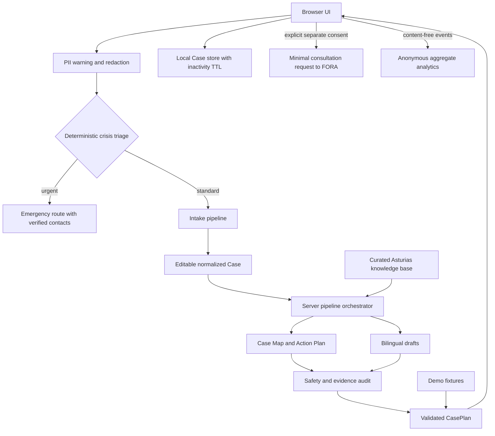

# FORA Navigator — MVP Product and Technical Plan

> Статус: Фаза 0 и Итерации 1–3 утверждены владельцем продукта; Итерация 4 выполняется. Consultation handoff реализован в безопасном demo-first режиме и проходит финальную проверку.  
> Реальные данные, публичный live OpenAI API и consultation handoff остаются выключенными до соответствующих privacy/safety gates. Контролируемый API Mode предназначен только для явно подтверждённых вымышленных кейсов.

## 1. Краткая формулировка продукта

**FORA Navigator** — персональный AI-навигатор по социальным и административным процедурам для русско-, украино- и англоязычных семей мигрантов, заявителей и получателей защиты в Астурии, которые сопровождают ребёнка, подростка или молодого взрослого с инвалидностью или особыми потребностями.

MVP превращает свободное и неполное описание ситуации в развивающийся `Case`: уточняет только влияющие на маршрут сведения, выделяет срочные риски, показывает зависимости между действиями, собирает документы и готовит безопасные двуязычные черновики.

Главное обещание продукта: **«Я понимаю ситуацию, знаю следующий шаг и вижу весь маршрут»**.

FORA Navigator не заменяет врача, юриста, социального работника или орган власти, не ставит диагнозы, не даёт окончательных юридических заключений и не гарантирует результат процедуры.

## 2. Границы конкурсного MVP

### 2.1 Поддерживаемый сценарий

- География: Испания, автономное сообщество Asturias; демонстрационный город — Oviedo.
- Основной кейс: недавно переехавшая русскоязычная семья с 16-летним подростком с РАС.
- Темы: первичная медицинская навигация, образование, признание степени инвалидности, подготовка документов, социальная поддержка, язык и коммуникация.
- Интерфейс и навигационный ответ: русский, украинский и английский с глобальным выбором `RU · УКР · EN`. Черновики обращений доступны на русском, украинском и английском для проверки человеком и на испанском для местного адресата.
- Данные: полностью вымышленные демо-кейсы либо минимально необходимое описание пользователя без реальных идентификационных номеров и файлов.
- Режимы: полноценный детерминированный Demo Mode и опциональный API Mode.
- Хранение: введённое описание и структурированный Case по умолчанию остаются только на устройстве пользователя и автоматически удаляются после 90 дней бездействия; каждый возврат продлевает срок ещё на 90 дней. Можно выбрать session-only режим. Серверная история кейсов отсутствует.

### 2.2 Обязательные функции

1. Landing page с границами ответственности и понятным началом работы.
2. Свободное описание ситуации и загрузка демонстрационного кейса.
3. Адаптивный набор только тех уточнений, которые меняют маршрут.
4. Ранний кризисный triage и отдельный безопасный маршрут.
5. Редактируемое структурированное резюме Case.
6. Case Map по шести направлениям со статусами и зависимостями.
7. Action Plan по периодам: сейчас, 7 дней, месяц, позже.
8. Document Checklist без необоснованных утверждений об апостиле или присяжном переводе.
9. Не менее двух двуязычных черновиков, которые не отправляются автоматически.
10. Trust Panel с происхождением, применимостью и статусом проверки каждой существенной рекомендации.
11. Responses API, Structured Outputs, Zod-валидация каждого модельного этапа, одна попытка восстановления и безопасный fallback.
12. Demo Mode без API-ключа, пригодный для видео и живого показа судьям.
13. Печать/сохранение результата стандартными средствами браузера.
14. Mobile-first интерфейс, работа с клавиатуры, заметный фокус и минимальная когнитивная нагрузка.
15. CTA «Обсудить с человеком»: пользователь выбирает равного консультанта или специалиста, просматривает минимальный состав запроса и явно разрешает отправку в FORA.
16. Обезличенная продуктовая статистика без Case, narrative, контактов, диагнозов и устойчивого пользовательского идентификатора.
17. Ежемесячное email-напоминание оператору о проверке официальных источников; автоматика отмечает возможные изменения, но не подтверждает правило за человека.

### 2.3 Вне границ MVP

- Другие страны и все регионы Испании.
- Аккаунты, роли, платежи, CRM, административная панель и серверная история кейсов.
- Загрузка или хранение медицинских документов, OCR и обработка сканов.
- Импорт Telegram-чатов, scraping, автоматическое обучение на сообщениях.
- Автоматическая запись, отправка писем или заявлений в государственные органы. Единственное исключение — подтверждённый пользователем минимальный запрос на консультацию в FORA.
- Полный каталог льгот, выплат, миграционных процедур, диагнозов и лечения.
- Полноценный кабинет человеческой проверки, графовая БД и multi-agent инфраструктура.
- Автоматическое решение о праве на статус, выплату, лечение или образовательное место.

## 3. Пользовательский путь

1. **Ориентация.** Пользователь видит назначение FORA, узкую географию, ограничения и просьбу не вводить персональные номера.
2. **Описание.** Пишет ситуацию обычными словами либо загружает полностью вымышленный демо-кейс.
3. **Предварительная защита.** Клиент обнаруживает похожие на паспорт/NIE/страховую карту данные, предупреждает и предлагает обезличить текст. Детерминированный triage проверяет кризисные признаки до вызова модели.
4. **Адаптивные уточнения.** Система извлекает уже известные факты и задаёт небольшую порцию вопросов, которые действительно меняют маршрут. Причина каждого вопроса видима.
5. **Срочная развилка.** При угрозе жизни, насилии, бездомности, отсутствии жизненно важных лекарств или тяжёлой медицинской ситуации административный маршрут отходит на второй план. Показываются только заранее проверенные контакты; непроверенный номер заменяется настроечным placeholder.
6. **Проверка Case.** Пользователь видит состав семьи, цели, факты, неизвестное, риски и срочные потребности; может исправить данные.
7. **Генерация.** Сервер нормализует Case, отбирает только применимые знания, создаёт карту/план и отдельно проводит safety/evidence review.
8. **Case Map.** Пользователь видит шесть направлений, статусы и то, какой шаг разблокирует другие.
9. **Приоритетный план.** Сначала показаны максимум три ближайших действия; полный маршрут раскрывается по временным группам.
10. **Документы и письма.** Пользователь отмечает наличие документов, читает оговорки, переключает RU/УКР/EN/ES и копирует черновики после явной проверки.
11. **Надёжность.** Trust Panel объясняет происхождение, применимость и пределы каждой рекомендации без показа скрытой цепочки рассуждений.
12. **Продолжение позже.** Минимальный Case автоматически хранится только на этом устройстве до 90 дней бездействия; срок продлевается при возврате. Пользователь видит срок, может отказаться от сохранения или удалить всё немедленно.
13. **Разговор с человеком.** В любой момент после Case Summary пользователь выбирает «Равный консультант» или «Специалист». Система показывает отдельное короткое резюме для передачи; пользователь редактирует его, добавляет способ связи и подтверждает отправку. Полный Case, документы и история автоматически не прикладываются.

## 4. Список экранов

1. `/` — **Landing**: название, ценность, аудитория, ограничения, CTA.
2. `/describe` — **Описание ситуации**: textarea, приватность, кнопка демо-кейса.
3. `/intake` — **Уточняющие вопросы**: один смысловой вопрос на экран или короткая группа, причина вопроса, прогресс.
4. `/review` — **Case Summary**: состав семьи, цели, факты, неизвестное, риски, срочные потребности, редактирование.
5. `/generating` — **Подготовка маршрута**: видимые этапы процесса, состояние ошибки, переход в Demo Mode.
6. `/plan?tab=map` — **Case Map**: шесть доменов, статус каждого, узлы и зависимости.
7. `/plan?tab=actions` — **Action Plan**: сейчас, 7 дней, месяц, позже.
8. `/plan?tab=documents` — **Document Checklist**.
9. `/plan?tab=drafts` — **Draft Generator**: минимум медицинское и образовательное обращения, RU/УКР/EN/ES.
10. `/plan?tab=trust` — **Trust Panel**: источники, evidence, применимость, human review.
11. `/emergency` — **Срочная помощь**: безопасная остановка обычного flow и только проверенная конфигурация контактов.
12. `/consultation` — **Запрос консультации**: выбор равного консультанта/специалиста, понятное объяснение передачи, редактируемый минимум данных, контакт, preview и отдельное согласие.

Экраны 6–10 реализуются вкладками одной страницы `/plan`, чтобы не дублировать состояние и ускорить конкурсный сценарий. Их информационная архитектура остаётся раздельной.

## 5. Модель Case

`Case` — не одно сообщение, а версия ситуации во времени. Каждое изменение вводных делает текущий план устаревшим и требует явного пересоздания.

### 5.1 Основные сущности

| Сущность | Назначение | Ключевые поля |
| --- | --- | --- |
| `Case` | Корневой объект текущего дела | `id`, `version`, `locale`, `location`, `household`, `needs`, `goals`, `facts`, `unknowns`, `risks`, `urgency`, `domains`, `history` |
| `Person` | Обезличенный член семьи | `id`, `role`, `ageRange`, `supportNeeds`; без имени и точной даты рождения |
| `Household` | Состав семьи и контекст сопровождения | `members`, `caregiverLanguage`, `constraints` |
| `Need` | Потребность в одном домене | `domain`, `priority`, `description`, `status` |
| `Goal` | Желаемый проверяемый результат | `domain`, `description`, `targetTimeframe` |
| `Fact` | Утверждение, подтверждённое пользователем или документом | `statement`, `origin`, `confirmedByUser`, `capturedAt` |
| `Unknown` | Пробел, способный изменить маршрут | `question`, `impact`, `blocking`, `resolutionMethod` |
| `Risk` | Медицинский, административный, социальный или privacy-риск | `category`, `severity`, `signal`, `mitigation` |
| `UrgencyAssessment` | Результат triage | `level`, `signals`, `stopNormalFlow`, `safeMessage`, `verifiedContactIds` |

### 5.2 Case Map

`CaseDomain` принимает одно из значений:

- `healthcare`;
- `education`;
- `disability_recognition`;
- `documents`;
- `social_support`;
- `language_communication`.

Статус домена и узла: `not_started | in_progress | blocked | waiting | completed | needs_verification`.

| Сущность | Ключевые поля |
| --- | --- |
| `CaseNode` | `id`, `domain`, `title`, `status`, `actionStepId?`, `blockingReason?`, `evidenceRecordIds` |
| `CaseDependency` | `id`, `fromNodeId`, `toNodeId`, `type: requires | helps | alternative`, `explanation` |
| `ActionStep` | `timeframe`, `priority`, `action`, `why`, `dependsOn`, `destination`, `documents`, `expectedResult`, `obstacles`, `channel`, `evidenceRecordIds`, `humanReviewRequired` |
| `DocumentItem` | `status`, `appliesTo`, `note`, `evidenceRecordIds`; статус не превращается в юридическое требование без evidence |
| `DraftDocument` | `kind`, `recipient`, `subjectRu/Es`, `bodyRu/Es`, `placeholders`, `requiresUserReview: true` |
| `CasePlan` | `caseVersion`, `map`, `actions`, `documents`, `drafts`, `trust`, `generatedAt`, `mode` |

Статусы документа: `available | missing | translation_recommended | verification_required | sworn_translation_maybe | legalization_or_apostille_maybe`.

### 5.3 История и пересоздание

- `CaseHistoryEvent` фиксирует только локально: `case_created`, `answer_changed`, `summary_confirmed`, `plan_generated`, `plan_invalidated`.
- Изменение факта увеличивает `Case.version` и помечает прошлый `CasePlan` как `stale`.
- MVP не ведёт медицинский журнал и не хранит полные предыдущие тексты на сервере.
- Сохранённый локально объект содержит `schemaVersion`, `lastActiveAt`, `deleteAfter` и минимальный `NormalizedCase`; несовместимая версия или истёкший TTL удаляется, а не мигрируется с риском искажения.

## 6. Модель знаний

### 6.1 Пять концептуальных слоёв

1. **Official Knowledge** — закон, орган власти, официальная процедура.
2. **Professional Knowledge** — доказательная практика: международный или национальный консенсус, клиническая/профессиональная рекомендация, систематический обзор или стандарт признанной профессиональной организации. Индивидуальное мнение специалиста само по себе не получает статус доказательной рекомендации.
3. **Community Knowledge** — вручную подготовленный обезличенный опыт сообщества.
4. **Organization Knowledge** — опубликованные или явно промаркированные как собственные материалы сайта, видео и чатов FORA, а также редакционные выводы FORA. Чужие сообщения не становятся позицией организации автоматически.
5. **Personal Context** — факты текущей семьи; это вход для сопоставления, а не внешний источник истины.

### 6.2 Структура записи

`KnowledgeItem` содержит:

- `id`, `title`, `summary`, `jurisdiction`, `domains`, `appliesWhen`, `doesNotApplyWhen`;
- `knowledgeType: official | professional | community | organization | ai_inference`;
- `sourceIds`, `lastVerifiedAt`, `reviewDueAt`, `verificationStatus`, `checkedBy`, `expertReviewRequired`;
- `limitations`, `safeWording`, `allowedClaims`;
- `qualityNotes`, `supersedesId?`, `expiresAt?`, `changeDetectionStatus`.

`KnowledgeSource` содержит `title`, `publisher`, `url?`, `sourceType`, `jurisdiction`, `publishedAt?`, `retrievedAt`, `lastVerifiedAt`, `reviewDueAt`, `reviewerRole`, `contentFingerprint?` и `archivedReference?`.

Статус проверки: `verified | partially_verified | unverified | expired | disputed`.

### 6.3 CommunityExperience

Только обезличенные поля:

- регион и тип ситуации;
- действие и описанный результат;
- примерный срок как текстовый диапазон, а не обещание;
- препятствия и дата опыта;
- количество похожих сообщений/кейсов только при наличии реального подсчёта;
- статус проверки: `unreviewed | owner_reviewed | expert_reviewed`;
- обязательное предупреждение о нерепрезентативности.

Допустимые формулировки: «В нескольких похожих обезличенных кейсах сообщества», «По предварительному опыту сообщества», «Требует дополнительной проверки». Проценты и статистика без набора данных запрещены.

### 6.4 ExpertCorrection

`ExpertCorrection` хранит `knowledgeItemId`, `field`, `previousValue`, `correctedValue`, `reason`, `expertRole`, `reviewedAt`, `status`. В конкурсном MVP внешних экспертов нет: запись может получить только честную отметку `owner_reviewed`, если её проверила владелец FORA. `expert_reviewed` запрещён без документированной компетенции reviewer. Интерфейс редактора не создаётся.

### 6.5 Правило retrieval

MVP не ищет процедуры в открытом интернете во время пользовательского запроса. Сервер выбирает небольшой набор записей из версионируемой локальной базы по региону, домену и `appliesWhen`. Модель может ссылаться только на переданные `KnowledgeItem.id`; неизвестный источник не должен появиться в результате.

### 6.6 Ежемесячная проверка актуальности

Владелец процесса — FORA. Для official knowledge период проверки — один раз в месяц; запись автоматически получает `expired`, если `reviewDueAt` прошло и подтверждение не внесено.

MVP содержит лёгкий source-freshness workflow без административной панели:

1. `pnpm knowledge:due` формирует список источников, которые пора проверить.
2. Защищённая ежемесячная scheduled job запускает due-report и отправляет оператору email на приватный `OWNER_NOTIFICATION_EMAIL`. В письме только названия/URL/сроки источников, никаких данных пользователей или Case.
3. Автоматический анализ сравнивает сохранённый fingerprint/фрагмент с официальной страницей и может поставить только `possible_change`, `unreachable` или `no_machine_detected_change`.
4. В Trust Panel или локальном review-артефакте кнопка «Открыть официальный источник» показывает сохранённый тезис рядом с оригинальной страницей.
5. Проверяющий FORA выбирает: `без изменений`, `изменилось`, `не удалось подтвердить`.
6. Только человек может вернуть статус `verified`; отсутствие найденного автоматикой изменения не считается человеческой проверкой.
7. Подтверждение фиксирует дату, роль проверяющего, официальный URL и короткую заметку о проверенном фрагменте.

Автоматизацию можно постепенно расширить помощником с web search, ограниченным allowlist официальных доменов, который готовит diff/report. Он не обновляет правила и не публикует вывод без подтверждения FORA. Это проверка актуальности, а не web scraping пользовательских кейсов.

### 6.7 Стандарт доказательности

Приоритет источников профессиональных рекомендаций:

1. действующее право и официальная процедура Испании/Asturias — для административного маршрута;
2. национальные и международные клинические или профессиональные guidelines/consensus;
3. систематические обзоры и рекомендации признанных профессиональных организаций;
4. практика FORA, явно промаркированная как организационная;
5. обезличенный опыт сообщества;
6. AI inference — только для сопоставления и формулировки вопроса, не как источник правила.

Международный консенсус задаёт безопасные профессиональные рамки, но не заменяет локальный официальный источник для права, документов, сроков и процедуры. В конкурсном MVP нет бюджета на внешнюю экспертную панель. Поэтому владелец FORA может проверять ясность, соответствие опыту организации и корректность цитирования, но такая проверка маркируется `owner_reviewed`, а не `expert_reviewed`. AI помогает извлечь тезисы, найти противоречия и сформировать due-report, но не повышает уровень доказательности.

До появления профильных reviewers продукт не публикует от своего имени клинические назначения, медицинские интерпретации или окончательные юридические выводы. Такие места либо опираются на прямую ссылку на действующий официальный/guideline-источник с датой проверки, либо заменяются вопросом специалисту. Независимая экспертная проверка остаётся следующим этапом перед масштабным реальным пилотом, когда появится финансирование.

### 6.8 Безопасная подготовка знаний из чатов FORA

В MVP нет прямого подключения к Telegram/WhatsApp и нет обучения модели на чатах. Владелец вручную выбирает материал, который FORA вправе использовать, удаляет имена, контакты, точные даты/места и уникальные детали, после чего AI может подготовить черновик: тема, наблюдавшееся препятствие, предпринятое действие, описанный результат, дата опыта и ограничения. AI также отмечает возможные PII, противоречия и утверждения, требующие официального источника.

Перед добавлением в KB владелец подтверждает право использования, достаточность обезличивания и безопасную формулировку. Сообщение участника остаётся `community`; опубликованный редакционный материал FORA — `organization`. Ни один чат не становится доказательством правила, статистикой или профессиональной рекомендацией. Автоматический ingestion, поиск по живым чатам и массовая дедупликация остаются roadmap после отдельной consent/governance-процедуры.

## 7. Модель доверия и Transparent Case Reasoning

### 7.1 Независимые измерения

FORA не использует один «магический» trust score. Интерфейс показывает отдельно:

1. **Тип и авторитетность источника** — official, professional, community, organization, AI inference.
2. **Статус проверки знания** — verified, partially verified, unverified, expired, disputed.
3. **Применимость к текущему Case** — applicable, possibly_applicable, not_enough_context.
4. **Уверенность модели в сопоставлении** — high, medium, low.
5. **Необходимость человеческой проверки** — да/нет и роль проверяющего.

Уверенность модели не повышает юридическую надёжность источника. Официальный источник может быть устаревшим, а уверенный AI-вывод — всё равно лишь выводом.

### 7.2 EvidenceRecord и TrustAssessment

`EvidenceRecord` связывает одну отображаемую рекомендацию с:

- `claimId` и `caseFactIds` — на каких подтверждённых данных Case она основана;
- `knowledgeItemIds` и `sourceIds` — откуда она появилась;
- `verificationStatus`, `lastVerifiedAt`, `jurisdiction`;
- `applicability`, `modelConfidence`, `humanReviewRequired`, `reviewerRole?`;
- `safeRationale` — короткое объяснение без скрытой цепочки рассуждений;
- `caveat` — что именно нужно проверить.

`TrustAssessment` агрегирует evidence без усреднения: количество шагов без официального подтверждения, просроченные источники, спорные сведения и обязательные human-review точки.

### 7.3 Правила отображения

- Существенный шаг без `EvidenceRecord` не проходит audit.
- AI inference всегда маркируется и требует проверки.
- Community knowledge никогда не формулируется как общее правило или гарантия.
- `expired` и `disputed` нельзя использовать как единственное основание административного действия.
- Пользователь видит «почему этот шаг сейчас», «что он разблокирует» и «что проверить», но не внутренний chain-of-thought.

## 8. Архитектура

### 8.1 Технологии

- Next.js App Router, React, TypeScript.
- Tailwind CSS для mobile-first дизайн-системы.
- Zod как единый источник runtime-схем Case, каждого модельного этапа и итогового плана.
- Официальный OpenAI JavaScript SDK и Responses API.
- Structured Outputs через `openai.responses.parse` и `zodTextFormat`.
- Основная модель API Mode: **`gpt-5.6-terra`** — выбранный баланс качества и стоимости для многоэтапного pipeline.
- `gpt-5.6-sol` может использоваться только как эталон в ограниченных eval до пилота, если владелец подтвердит бюджет; UI и схемы от модели не зависят.
- Vitest + Testing Library; Playwright для основного и mobile e2e.
- Vercel-ready deployment.

Выбор API подтверждается официальной документацией OpenAI: [каталог моделей](https://developers.openai.com/api/docs/models), [GPT-5.6 Terra](https://developers.openai.com/api/docs/models/gpt-5.6-terra), [Structured Outputs](https://developers.openai.com/api/docs/guides/structured-outputs).

### 8.2 Компоненты

- **Web UI** — ввод, review, Case Map, plan tabs, печать.
- **Local Case store** — session state и минимальный versioned Case в browser storage с 90-дневным inactivity TTL; без серверной истории кейсов.
- **Safety layer** — PII detection/redaction, crisis triage, запрет гарантий и опасных формулировок.
- **Case engine** — нормализация, зависимости, invalidation и сборка view model.
- **Knowledge repository** — локальные типизированные записи и allowlist источников.
- **AI pipeline** — последовательные узкие prompt-модули с отдельными схемами.
- **Evidence audit** — программные инварианты и финальный модельный review.
- **Demo provider** — предвычисленные fixtures, проходящие те же итоговые схемы и UI.
- **Consultation handoff** — отдельный endpoint, который принимает только просмотренный пользователем `ConsultationRequest`, отправляет его в FORA и не имеет доступа к browser storage без явной сборки preview.
- **Anonymous analytics** — агрегированные page views и разрешённые event names без Case content, контактов и custom properties.
- **Freshness notifier** — monthly scheduled job с due-list и email оператору; payload не содержит пользовательских данных.

### 8.3 Диаграмма



### 8.4 Развёртывание

- Конкурсная версия: отдельный Vercel project `fora-navigator`, Demo Mode по умолчанию, preview URL до завершения legal/privacy gate.
- Vercel Functions явно закрепляются в регионе ЕС (`fra1`); значение по умолчанию не используется.
- Регион функции не считается доказательством полной EU data residency: до пилота отдельно проверяются Vercel DPA, subprocessors, platform logs, analytics и фактические пути передачи данных.
- Канонический сайт FORA — [ngo-fora.com](https://ngo-fora.com/). Рекомендуемый адрес публичного пилота — `navigator.ngo-fora.com`, чтобы оператор, бренд и контакты были однозначны.
- На сайте публикуются legal notice, privacy notice и контакты оператора. API keys существуют только в server-side environment variables.
- Live API включается feature flag только после утверждения DPIA, consent text, OpenAI DPA/data controls и verified emergency contacts.
- Временный приватный email владельца хранится только в environment variable `OWNER_NOTIFICATION_EMAIL` и не попадает в клиентский bundle. Для публичного privacy contact предпочтителен алиас на домене, например `privacy@ngo-fora.com`; существующий публичный адрес сайта может оставаться каналом консультаций.
- Vercel Web Analytics подходит для анонимных page views без cookies. Custom events (`case_started`, `plan_generated`, `consultation_peer_requested`, `consultation_specialist_requested`) используются только на Pro/Enterprise и не содержат properties; на Hobby MVP ограничивается page views и счётчиком фактически доставленных consultation emails. Документация: [privacy](https://vercel.com/docs/analytics/privacy-policy), [limits and pricing](https://vercel.com/docs/analytics/limits-and-pricing).

## 9. API Mode: пошаговый pipeline

Конкурсный API Mode использует один ограниченный Structured Outputs-вызов внутри семи наблюдаемых этапов. Safety, редактирование, выбор базы знаний и финальная предметная проверка остаются детерминированными; поэтому модель не принимает решение о согласии, кризисе или допустимых источниках. Семь API-вызовов не используются: это ухудшило бы стоимость, задержку и число точек отказа без пользы для узкого MVP.

| Этап | Вход | Выход | Вызов модели |
| --- | --- | --- | --- |
| 1. Consent and feature gate | request headers и versioned consent | разрешение продолжить либо fail-closed | нет |
| 2. Redaction and safety | вымышленный Case | скрытые контакты/ID, urgency и unsafe-request result | нет |
| 3. Official knowledge grounding | безопасный Case + локальная KB | ограниченный prompt с каноническими sources | нет |
| 4. Structured generation | безопасный Case + KB digest | полный `ModelNavigationPlan` | один Responses API call |
| 5. Schema validation | Structured Output | Zod-valid объект либо repair reason | SDK + Zod, без нового вызова; при ошибке одна repair-попытка |
| 6. Evidence and dependency audit | Zod-valid plan + canonical KB | проверенные source metadata, documents, IDs, DAG и safety invariants | нет |
| 7. Safe delivery or local fallback | audited plan либо безопасная категория ошибки | `FinalNavigationPlan` с честной меткой `live`/`demo` | нет |

### 9.1 Endpoint flow

- Intake, уточнения и Case Summary выполняются в браузере и не вызывают OpenAI.
- `POST /api/navigate` — единая competition-only граница этапов 1–7; при выключенном `ENABLE_LIVE_AI` возвращает `LIVE_AI_DISABLED` до чтения body.
- Реализация Итерации 4: `POST /api/consultation` принимает отдельный `ConsultationRequest` после preview и consent, выполняет rate limit, в live-конфигурации отправляет минимальное письмо в FORA и возвращает receipt ID без Case content. `GET` этого endpoint сообщает UI только активный режим `demo | email`.
- `GET/POST /api/knowledge-review` — защищённый cron endpoint: формирует due-list и отправляет служебное напоминание владельцу; пользовательские данные не читает.
- `GET /api/health` не нужен для пользовательского MVP; состояние Demo/API отображается из конфигурации при генерации.

### 9.2 Настройки модели и стоимость

- По умолчанию `OPENAI_MODEL=gpt-5.6-terra`.
- `reasoning.effort=medium`, `text.verbosity=medium`, `max_output_tokens=8000` на попытку, SDK timeout 45 секунд и `maxRetries=0`; допустима только одна контролируемая repair-попытка приложения. При текущей цене Terra две полностью исчерпанные попытки ограничивают output-часть бюджета примерно $0.24; фактический total с input проверяется live-замерами.
- Один узкий prompt содержит минимизированный Case, consistency warnings, ограниченную локальную KB и строгий контракт результата.
- Запросы независимы, без `previous_response_id`, tools, web search, files или background mode; API не является хранилищем Case.
- Каждый вызов передаёт `store:false`. Это не означает Zero Data Retention: стандартные abuse-monitoring logs OpenAI могут храниться до 30 дней, что прямо раскрывается перед согласием.
- На UI не показываются reasoning tokens или chain-of-thought; показываются только `safeRationale` и evidence.
- Начальный инженерный бюджет, а не публичное SLA: целевая средняя стоимость одного полного live-кейса не более **$0.15**, worst-case с одной repair-попыткой не более **$0.30**. Фактические значения ещё не измерены: live smoke без разрешённого API key не выполнялся.
- Целевые показатели до замеров: p50 12–18 секунд, p95 не более 30 секунд, hard timeout 45 секунд. После первых 30 разрешённых тестовых прогонов пороги пересматриваются по фактической телеметрии без пользовательского содержания.
- `gpt-5.6-terra` используется во всём runtime MVP. `gpt-5.6-sol` запускается только офлайн на фиксированном eval-наборе как reference; автоматического дорогого fallback на Sol нет.
- Terra допускается к пилоту, если на eval достигается: 100% блокировки crisis-кейсов, 100% запрета неизвестных source IDs, не менее 98% schema-valid ответов после допустимого repair и отсутствие критических ошибок в human review.

### 9.3 Ошибки и восстановление

1. Structured Output парсится SDK и повторно валидируется доменными Zod-инвариантами.
2. При исправимой ошибке выполняется одна repair-попытка с тем же уже редактированным Case и короткой безопасной категорией ошибки; лимит — одна попытка на пользовательский запуск.
3. Refusal, incomplete response, timeout, rate limit, schema/evidence failure и отсутствие API key не показывают сырой SDK error. Возвращается ясно маркированный локальный маршрут либо понятная ошибка.
4. `EMERGENCY_STOP`, unsafe request и invalid consent никогда не превращаются в обычный fallback-план.
5. Локальный fallback строится по текущему Case тем же типизированным шаблоном, а не подставляет план другой семьи; результат всегда имеет `mode=demo`.

## 10. Demo Mode

- Не требует `OPENAI_API_KEY` и не вызывает сеть.
- Содержит основной вымышленный кейс Oviedo и минимальные fixtures для короткого, противоречивого и кризисного ввода.
- Демо-результат соответствует тем же Zod-схемам, что API Mode.
- Пользователь проходит все экраны, может менять ответы и видеть контролируемое пересоздание варианта плана.
- В интерфейсе постоянно видна метка «Демонстрационный пример»; фиктивные сведения не выдаются за реальные решения органа.
- Никакая вымышленная статистика сообщества не используется.

### 10.1 Запрос живой консультации

`ConsultationRequest` отделён от Case и содержит только:

- `route: peer_consultant | specialist`;
- крупную тему из закрытого списка и страну/регион;
- выбранный пользователем канал обратной связи и контакт;
- необязательное редактируемое резюме до 500 знаков;
- версии privacy notice/consent, timestamp и случайный receipt ID.

Перед отправкой система простыми словами объясняет разницу: **равный консультант** делится опытом и помогает сориентироваться, но не заменяет профильного специалиста; **специалист** нужен для профессионального вопроса, а FORA сначала уточнит доступность и подходящую компетенцию. Если пользователь не уверен, интерфейс рекомендует равного консультанта как первую навигационную точку, не скрывая возможность сразу выбрать специалиста.

На email FORA уходит только содержимое preview. Запрещены скрытое прикрепление полного Case, raw narrative, chat history, документов, source IDs и аналитического идентификатора. Для MVP почтовый ящик является очередью входящих запросов: письмо получает нейтральную тему с receipt ID, route и категорией; подробные данные о здоровье не должны попадать в subject. Отправка требует rate limit, CAPTCHA/honeypot, нейтрального success state и понятного сообщения, что это не экстренная служба и срок ответа не гарантирован.

Получатель по умолчанию — опубликованный на [сайте FORA](https://ngo-fora.com/) адрес `fora.disability@gmail.com`; приватный адрес владельца используется только для служебных уведомлений. Рекомендуемый MVP-срок: запрос хранится, пока консультация открыта, и удаляется через 90 дней после её закрытия или последнего содержательного контакта; спам и недоставленные запросы — через 30 дней. Долгосрочно остаются только агрегированные количества по месяцу/route без контакта и текста. Доступ к ящику имеет только назначенный оператор/консультант, а удаление выполняется по label-based процедуре. Предпочтительное последующее улучшение — рабочий alias `consult@ngo-fora.com`.

## 11. Приватность и безопасность

### 11.1 Минимизация данных

- Поля не запрашивают ФИО, точную дату рождения, полный адрес, паспорт, NIE, страховой или медицинский номер.
- Файлы и медицинские документы не принимаются.
- Narrative проверяется до отправки; после отдельного согласия похожие на контакты и номера документов фрагменты маскируются до вызова OpenAI.
- Продукт не называет пользовательский текст «анонимным»: даже без имени он может косвенно идентифицировать семью. В архитектуре это псевдонимизированные чувствительные данные.
- По умолчанию введённое описание и структурированный Case сохраняются в browser storage только на этом устройстве. Inactivity TTL — 90 дней; каждое возвращение продлевает срок. Пользователь может выбрать session-only режим; предупреждение об общем устройстве и кнопка «Удалить всё сейчас» обязательны.
- До первого сохранения UI коротко предупреждает: «На общем устройстве другие люди с доступом к этому браузеру смогут открыть ваш маршрут». На общем устройстве предлагается session-only режим. Серверная синхронизация и аккаунт отсутствуют.
- API-ключ хранится только на сервере. Логи не должны содержать narrative, ответы или модельный JSON.

### 11.2 Согласие на API и роли по GDPR

- Data Controller может быть физическим или юридическим лицом, которое определяет цели и способы обработки. Пока FORA не зарегистрирована, временным оператором может быть владелец проекта как физическое лицо; в документах указывается не только бренд FORA, а полное имя этого человека.
- Для текущего MVP временный контролёр: **Elena Bagaradnikova (Елена Багарадникова), физическое лицо, Испания**. Подтверждённый адрес для публикации в legal notice: **Ayones 31, Latores, C.P. 33193 de Oviedo, España**.
- `fora.disability@gmail.com` является допустимым публичным **email-контактом**, но не заменяет физический адрес в legal notice. Статья 10 LSSI перечисляет отдельно `residencia o domicilio` (либо адрес постоянного учреждения в Испании) и `dirección de correo electrónico`; поэтому в документе должны быть оба поля.
- Одного email недостаточно. До реального пилота нужны: полное legal name; страна и применимый закон; адрес для legal notice/реализации прав (по возможности отдельный рабочий, а не домашний); публичный privacy contact; описание целей, категорий данных, получателей, правовых оснований и сроков; порядок доступа/исправления/удаления/отзыва; register of processing, DPIA/risk assessment, incident response и processor agreements с OpenAI, Vercel, email- и analytics-провайдерами. Регистрационные данные указываются только если они применимы.
- Если оператор находится в Испании или сервис подпадает под испанское право, отдельно проверяется legal notice по статье 10 LSSI: имя/наименование, адрес, email/прямой контакт и применимые регистрационные/профессиональные данные. Для согласия несовершеннолетних учитывается статья 7 LOPDGDD; из-за сочетания AI, чувствительных данных и информации о детях DPIA практически необходима до live pilot.
- OpenAI при API-обработке выступает processor по DPA; для EEA договорная сторона — OpenAI Ireland. До пилота сохраняются применимый DPA и перечень subprocessors.
- До первого API-вызова пользователь получает два равноценных пути: **«Создать маршрут с помощью AI»** и **«Продолжить без отправки данных в OpenAI»**. Второй путь открывает локальный intake/Demo Mode и не является наказанием за отказ.
- Рекомендуемый короткий текст до выбора: «Чтобы составить маршрут под вашу ситуацию, FORA может отправить в OpenAI обезличенное описание без имён, номеров и документов. OpenAI обработает его по поручению оператора; по стандартным настройкам технические журналы могут храниться до 30 дней, а API-данные не используются для обучения моделей без отдельного разрешения FORA. Без вашего согласия мы ничего не отправим — можно продолжить локально».
- Под коротким текстом есть раскрываемое «Подробнее»: какие поля уйдут, цель, получатели, фактический срок, чувствительность сведений о здоровье/инвалидности, трансграничная передача, отзыв для будущей обработки и privacy contact. Checkbox не предустановлен; версия текста фиксируется.
- Пользователь подтверждает, что является совершеннолетним и вправе сообщать минимальные сведения о сопровождаемом человеке. Публичный MVP не предназначен для самостоятельного использования несовершеннолетними.
- Для реальных данных ребёнка/подростка правовое основание согласия самого несовершеннолетнего и/или законного представителя проверяется специалистом по испанскому праву; конкурсный сценарий остаётся полностью вымышленным.
- Для конкурсной версии consent receipt хранится в сессии. До публичного пилота нужен минимальный server-side audit receipt: случайный session ID, версия privacy notice/consent, выбор и timestamp — без narrative и фактов Case, с отдельным сроком удаления.
- Responses API вызывается с `store: false`, без files, web search, conversations и background mode. Следует учитывать, что стандартные abuse-monitoring logs OpenAI могут хранить customer content до 30 дней; Zero Data Retention требует отдельного одобрения OpenAI.
- Цель пилота: OpenAI project с Europe data residency и, если доступно, Zero Data Retention. Если эти опции недоступны, transfer/retention явно описываются пользователю и отдельно оцениваются в DPIA.

Опорные документы: [GDPR: controller и special-category data](https://eur-lex.europa.eu/eli/reg/2016/679/oj), [Spanish LSSI, статья 10](https://www.boe.es/buscar/act.php?id=BOE-A-2002-13758&p=20241224&tn=0), [Spanish LOPDGDD, статья 7](https://www.boe.es/buscar/doc.php?id=BOE-A-2018-16673), [AEPD: критерии DPIA](https://www.aepd.es/prensa-y-comunicacion/notas-de-prensa/la-aepd-publica-el-listado-de-tratamientos-en-los-que-es), [OpenAI data controls](https://developers.openai.com/api/docs/guides/your-data), [OpenAI DPA](https://openai.com/policies/data-processing-addendum/), [OpenAI Under-18 API Guidance](https://developers.openai.com/api/docs/guides/safety-checks/under-18-api-guidance).

### 11.3 Локальная история, аналитика и запросы — три разных контура

| Контур | Что видит FORA | Где хранится | Основание/контроль |
| --- | --- | --- | --- |
| Локальный Case | Ничего, пока человек отдельно не запускает AI или handoff | браузер пользователя, 90 дней бездействия | настройки хранения и «Удалить всё» |
| Анонимная аналитика | агрегированные просмотры и, на подходящем тарифе, имена событий | Vercel Analytics без cookies; без custom properties | описывается в privacy notice; никакого Case content |
| Запрос консультации | route, категория, регион, выбранный контакт и отредактированное короткое резюме | почтовая очередь FORA по отдельному сроку | отдельное явное согласие и preview перед отправкой |

Это отвечает на продуктовый вопрос: FORA может видеть, сколько людей открывало сервис, а при Pro — сколько начинало Case, получало план и отправляло handoff, не получая их локальные ответы. Сами консультационные запросы видны в рабочем почтовом ящике и считаются отдельно. Связать анонимное посещение с конкретным запросом или восстановить путь одного человека нельзя и не нужно.

События allowlist: `case_started`, `plan_generated`, `consultation_peer_requested`, `consultation_specialist_requested`. Route кодируется только одним из двух фиксированных имён события, не property. Запрещены custom properties, свободный текст, route/query с идентификаторами, email, возраст, регион ниже страны, диагноз, кризисный статус и стабильный user/session ID. Page paths должны быть статическими; `beforeSend` удаляет query parameters. Если Vercel Pro не оплачен, конкурсный MVP показывает только page views; число consultation requests определяется по успешно отправленным письмам/receipt ID.

Согласие на OpenAI и согласие на консультационный handoff независимы: разрешение AI не разрешает передавать данные консультанту, и наоборот. Рекомендуемый текст handoff: «Вы сами выбираете, что увидит FORA. Мы отправим только показанные ниже контакт, категорию и короткое резюме. Полный маршрут и история останутся на вашем устройстве».

### 11.4 Crisis route

- Triage до модели проверяет угрозу жизни, насилие, бездомность, отсутствие жизненно важных лекарств, непосредственную опасность и тяжёлую медицинскую ситуацию.
- Обычный административный план останавливается, если `stopNormalFlow=true`.
- Контакты берутся из отдельного `verified-emergency-contacts` реестра с датой проверки; до заполнения показывается явный placeholder, а не придуманный номер.
- Crisis flow покрывается отдельными тестами и совместной ручной проверкой владельца продукта; номера и формулировки не публикуются, пока владелец явно их не подтвердит. Профильная проверка добавляется позднее при доступности специалиста.

### 11.5 Защитные инварианты

- Нет диагнозов, назначения лечения или окончательного юридического заключения.
- Нет гарантий статуса, выплаты, места, услуги или срока решения.
- Нет автоматической отправки документов.
- Нет скрытой передачи Case живому консультанту; только отдельный preview и consent.
- Нет административного действия без evidence или явного `needs_verification`.
- Community/AI сведения не маскируются под official.
- Safety выше полноты: сомнительный шаг удаляется или маркируется, а не «додумывается».

### 11.6 Gate публичного пилота

Конкурсный Demo Mode может использовать только вымышленные данные. Приём реальных пользовательских кейсов включается после:

1. фиксации физического или юридического оператора за брендом FORA и legal notice;
2. DPIA/оценки рисков для AI, данных о здоровье и несовершеннолетних;
3. privacy notice, explicit consent и процедуры отзыва/удаления;
4. договорных и технических настроек OpenAI и Vercel;
5. подтверждения emergency contacts;
6. процедуры breach response и ответственного privacy contact;
7. ограниченного consultation handoff: утверждённого получателя, срока хранения писем, доступа, удаления, anti-spam и отдельного consent;
8. проверки текущей формы консультации на ngo-fora.com: identity контролёра, privacy notice, цели/сроки и необходимость загрузки медицинских документов должны быть согласованы с политикой Navigator.
9. rate limit для `/api/navigate`, OpenAI project spend cap и эксплуатационный мониторинг без содержимого Case.

Это продуктовая рекомендация, а не окончательное юридическое заключение; документы перед пилотом проверяет специалист по защите данных в Испании.

### 11.7 Согласование с текущим сайтом FORA

На [ngo-fora.com](https://ngo-fora.com/) уже есть форма бесплатной консультации, в которой можно описать ситуацию и прикрепить медицинские документы; опубликованное согласие сформулировано широко, а срок хранения привязан к ликвидации проекта или отзыву. Navigator не копирует этот текст и не принимает файлы.

До связывания двух форм нужен отдельный privacy-review текущего сайта: явно назвать физическое лицо-контролёра, разделить цели консультации/рассылки/аналитики, дать ссылку на полную privacy notice, установить конечные сроки хранения, объяснить права и проверить, действительно ли загрузка медицинских документов необходима и защищена. Без этого Navigator ведёт только на собственный минимальный handoff, а не передаёт данные в существующую форму автоматически.

## 12. UX и доступность

- Спокойная человеческая визуальная система, не похожая на государственный или медицинский портал.
- Один главный вопрос/решение на экран; максимум три ближайших действия сверху.
- Базовый текст от 16 px, интерактивные области от 44×44 px.
- Видимый `:focus-visible`, логичный tab order, семантические заголовки, ARIA только там, где нативной семантики недостаточно.
- Статус передаётся текстом и иконкой, а не только цветом.
- Прогресс читается как «Шаг 2 из 4» и визуально.
- `prefers-reduced-motion`; никаких обязательных анимаций.
- Mobile viewport 390×844 является обязательной проверкой.
- Печать скрывает навигацию и сохраняет Case Map, actions, документы, drafts и источники.

## 13. Фактическая структура конкурсного MVP

```text
app/
  api/
    consultation/route.ts
    knowledge-review/route.ts
    navigate/route.ts
  emergency/page.tsx
  generating/page.tsx
  intake/page.tsx
  plan/page.tsx
  review/page.tsx
  globals.css
  layout.tsx
  page.tsx
components/
  consultation/consultation-panel.tsx
  intake/
  plan/
lib/
  ai/
    audit.ts
    consent.ts
    generate-plan.ts
    prompt.ts
  consultation/
    config.ts
    consent.ts
    contract.ts
    email.ts
    rate-limit.ts
  demo/
    cases.ts
    fallback-plan.ts
  knowledge/
    asturias.ts
    freshness.ts
  safety/
    redact.ts
    triage.ts
  schemas.ts
  storage.ts
scripts/
  check-knowledge-due.ts
  run-e2e.mjs
tests/
  unit/
  integration/
  e2e/
docs/
  MVP_PRODUCT_AND_TECHNICAL_PLAN.md
  COMPETITION_SUBMISSION.md
  DEMO_VIDEO_SCRIPT.md
README.md
.env.example
```

AI pipeline реализован обычными детерминированно оркестрируемыми функциями, а не автономными агентами. Consultation route физически отделён от browser storage и получает только собственный DTO.

## 14. Тестовая стратегия

| Сценарий | Ожидаемое поведение |
| --- | --- |
| Полный демо-кейс | весь flow, Case Map, plan, checklist, 2+ drafts, Trust Panel |
| Очень короткое описание | нет преждевременного плана; только значимые уточнения |
| Противоречивые данные | противоречие показано в `Unknown`; требуется подтверждение |
| Неизвестный статус | ветка `unknown`, без юридического вывода |
| Нет документов | статусы missing/verification, без утверждения об апостиле |
| Срочная медицинская ситуация | остановка normal flow и crisis route |
| Персональные номера | warning/redaction; номер не попадает в API fixture/log |
| Просьба гарантировать выплату | отказ от гарантии и проверяемая формулировка |
| Ошибка API | сохранённый Case, retry и явный Demo Mode |
| Невалидный JSON | одна repair-попытка, затем безопасная ошибка/fallback |
| Изменение Case | version increment и stale plan |
| Повторная генерация | новый план связан с текущей версией Case |
| Mobile 390×844 | нет горизонтального scroll/перекрытия действий |
| Возврат на том же устройстве | минимальный Case восстановлен, TTL продлён; raw narrative отсутствует |
| Истёкший/повреждённый local Case | безопасное удаление и понятное начало заново |
| Handoff равному консультанту | виден точный preview; email содержит только allowlist-поля и receipt ID |
| Отказ от handoff consent | ничего не отправлено, локальный Case сохранён |
| Попытка вложить Case/документ в handoff | schema reject; email не отправлен |
| Analytics event | только allowlist event name, без properties/query/stable ID |
| Monthly due job | письмо содержит только metadata источников; повторный вызов идемпотентен |

Дополнительно: schema contract tests для всех этапов, allowlist источников, dependency cycle detection, отсутствие action без evidence, отсутствие административного плана в emergency, запрет payload logging, rate-limit/anti-spam tests, клавиатурный e2e и production build.

## 15. Критерии готовности

MVP готов к конкурсной публикации, если:

- запускается по английской инструкции локально и собирается production build;
- основной вымышленный кейс проходится от landing до печати результата;
- без ключа работает полный Demo Mode;
- Case Map содержит шесть доменов, статусы и видимые зависимости;
- Action Plan показывает приоритет, причину, зависимости, документы, ожидаемый результат, препятствия и evidence;
- есть единый Document Checklist и минимум два двуязычных черновика;
- пользователь видит source type, jurisdiction, verification status, last verified, applicability, confidence и human review;
- official sources имеют `reviewDueAt`, ежемесячный due-report и ручное подтверждение FORA;
- due-report раз в месяц отправляет оператору служебное email-напоминание без пользовательских данных;
- уверенность модели не смешивается с надёжностью источника;
- непроверенные/просроченные/спорные сведения явно маркированы;
- PII не требуется, файлы не принимаются, локальный Case имеет 90-дневный inactivity TTL, session-only выбор и «Удалить всё»;
- API недоступен без отдельного explicit consent; отказ оставляет рабочий локальный/Demo путь;
- handoff позволяет выбрать равного консультанта или специалиста, показывает точный preview и не передаёт полный Case;
- анонимная аналитика не содержит Case content, custom properties или стабильных идентификаторов; отсутствие Pro не ломает продукт;
- crisis flow имеет проверенный реестр контактов и не генерирует обычный план;
- API error/refusal/invalid output не приводят к выдуманному персональному ответу;
- все 17 обязательных функций покрыты тестами на подходящем уровне;
- интерфейс работает на mobile viewport и с клавиатуры;
- README, архитектура, модель данных, privacy/safety, Devpost-текст, elevator pitch, описание OpenAI/Codex, видео-сценарий и roadmap готовы на английском;
- Vercel-конфигурация и environment variables документированы.
- публичный приём реальных кейсов выключен до прохождения privacy/legal gate.

## 16. Риски и меры

| Риск | Последствие | Мера |
| --- | --- | --- |
| Устаревшее административное правило | вредный или бесполезный шаг | ежемесячный due-report, дата/статус проверки, локальная allowlist KB, human review, узкая география |
| Модель придумывает источник | ложная уверенность | только переданные Knowledge IDs, Structured Outputs, evidence audit |
| Confidence воспринимается как юридическая надёжность | неверное доверие | отдельные поля и отдельные UI-badges, без единого score |
| Кризис маскируется под административный вопрос | задержка помощи | детерминированный preflight и hard stop normal flow |
| Пользователь вводит PII | лишняя обработка данных | предупреждение, redaction, локальное TTL-хранение, session-only выбор, no payload logs |
| Псевдонимизированный health/minor Case передаётся как будто он анонимен | неверное согласие и privacy-риск | explicit consent, DPIA, processor DPA, `store:false`, Europe/ZDR target, no-file policy |
| Неизвестный статус/регион | неприменимый план | явный `unknown`, applicability check, specialist question |
| API недоступен на показе | срыв демонстрации | schema-valid Demo Mode и заранее записанный сценарий |
| Семь узких модельных этапов дают цену/задержку | медленный UX | Terra, малые схемы/контекст, лимиты, этапы прогресса, eval бюджета |
| Слишком длинный маршрут | когнитивная перегрузка | top-3 actions, временные группы, раскрываемые детали |
| Community experience выглядит как статистика | манипулятивное впечатление | только честные формулировки, без процентов без датасета |
| Изменённый Case использует старый plan | несогласованность | version binding, stale flag, явное пересоздание |
| Локальный Case открыт на общем устройстве | раскрытие семье/третьим лицам | предупреждение до сохранения, session-only выбор, inactivity TTL, «Удалить всё» |
| В handoff скрыто уходит лишний Case | нарушение ожиданий и согласия | отдельный DTO, пользовательский preview, allowlist полей, запрет чтения local store endpoint-ом |
| Consultation email содержит медицинские детали | утечка чувствительных данных через почту | нейтральный subject, минимум полей, короткое редактируемое резюме, срок удаления и ограниченный доступ |
| Аналитика становится скрытым профилированием | потеря доверия и privacy-риск | только агрегаты, no cookies/properties/stable ID, статические paths, privacy notice |
| Автоматика ошибочно подтверждает правило | устаревшая рекомендация выглядит действующей | machine status не выше `possible_change`; `verified` возвращает только человек |

## 17. План коротких проверяемых итераций

### Итерация 1 — каркас и Demo Mode

**Статус 19 июля 2026:** реализовано, автоматические проверки пройдены и результат утверждён владельцем.

- Настроить Next.js, TypeScript, Tailwind, Zod и shell.
- Реализовать landing, describe, intake, review, generating и plan tabs.
- Добавить основной вымышленный Case и предвычисленный CasePlan.
- Проверка: typecheck, lint, schema tests, ручной end-to-end без API, mobile smoke.

Фактический результат: пользовательский flow генерирует план полностью локально и не вызывает `/api/navigate`; server endpoint возвращает `LIVE_AI_DISABLED` до чтения Case, если `ENABLE_LIVE_AI` не равен `true`. Пройдены 21 unit/integration и 10 desktop/mobile e2e проверок, production build, typecheck и lint. Live AI, реальные данные и consultation handoff не включались.

### Итерация 2 — доменная модель и безопасность

**Статус 19 июля 2026:** реализовано и готово к проверке владельцем. Добавлены языковой слой `RU · УКР · EN`, локализованный итоговый маршрут, черновики RU/УКР/EN/ES, документальные категории статуса проживания/защиты, зависимости и Case Map, versioned local/session store с 90-дневным inactivity TTL, source freshness metadata, кнопка официальной проверки и защищённое ежемесячное email-напоминание. Пройдены 31 unit/integration тест, 12 desktop/mobile e2e, typecheck, lint и production build. Live AI и реальные данные по-прежнему выключены.

- Реализовать Case/Knowledge/Trust schemas, Case Map и зависимости.
- Добавить local Case store с 90-дневным inactivity TTL, session-only режим, version invalidation, PII warning/redaction и crisis triage.
- Реализовать checklist, bilingual drafts и Trust Panel.
- Добавить source freshness fields, `knowledge:due`, защищённое monthly email reminder и кнопку открытия официального источника.
- Проверка: unit/integration tests для негативных сценариев и dependency/evidence invariants.

### Итерация 3 — OpenAI pipeline

**Статус 19 июля 2026:** реализовано и готово к проверке владельцем. Добавлены равноправный local/GPT выбор, отдельное consent с 15-минутным сроком и привязкой к Case, одноразовое session-хранение, честное раскрытие retention, Responses API + Structured Outputs, один repair, семь этапов и детерминированный postflight по sources/documents/dependencies/PII/guarantees. Live feature flag остаётся выключенным по умолчанию и допускает только вымышленные данные; runtime fail-closed принимает только Terra. Пройдены 59 unit/integration тестов, 16 desktop/mobile e2e, typecheck, lint и production build. Live smoke не выполнялся без разрешённого API key.

- Подключить SDK и `gpt-5.6-terra` через environment variable.
- Реализовать семь узких этапов, Structured Outputs, repair policy и error states.
- Добавить deterministic postflight и запрет неизвестных source IDs.
- Добавить explicit consent gate, `store:false`, consent version и отключённый по умолчанию live feature flag.
- Проверка: mocked contract tests; live smoke только при разрешённом ключе; сравнение live/demo shapes.

### Итерация 4 — конкурсный polish

**Статус 19 июля 2026:** реализованы три языка consultation UI, выбор peer/specialist, закрытая категория, контакт и редактируемое резюме, точный preview, независимое versioned consent, demo receipt и защищённый email-adapter. Endpoint принимает только отдельный DTO, не имеет доступа к Case/storage, блокирует PII в резюме, применяет honeypot и best-effort hashed-IP rate limit. Реальная отправка требует явного feature flag и полной server-side email-конфигурации; конкурсный default не отправляет данные. Unit/integration матрица расширена до 59 тестов, основной Playwright flow включает consultation demo. Конкурсный Preview развёрнут на [fora-navigator-source.vercel.app](https://fora-navigator-source.vercel.app); опубликованный smoke-check прошёл полный вымышленный intake, local plan и demo receipt, а API подтвердил `mode: demo` и запрет реальных данных.

- Реализовать consultation handoff: peer/specialist choice, preview, отдельный consent, минимальный email adapter, rate limit и receipt.
- Подключить анонимные page views; custom events — только если доступен Vercel Pro, без custom properties.
- Accessibility, keyboard, mobile, print, loading/error UX.
- Playwright main/mobile/emergency e2e и production build.
- README, architecture/data docs, Devpost, elevator pitch, OpenAI/Codex usage, 2–3-minute video script, roadmap.
- Проверка: clean install, Demo Mode без `.env`, Vercel preview в `fra1`, rehearsal по видео-сценарию.

После каждой итерации работа останавливается на короткую проверку; новые возможности не добавляются до прохождения её критериев.

## 18. Decision record по итогам ревью владельца

| № | Решение | Статус |
| --- | --- | --- |
| 1 | FORA Navigator — публичный информационный сервис; тот же продукт может использоваться в сопровождаемой консультации. План получает маркировку `AI-generated`, `FORA-reviewed` или `not reviewed`. | принято |
| 2 | Временный Data Controller — **Elena Bagaradnikova (Елена Багарадникова), физическое лицо, Испания**. Публичные контакты: адрес **Ayones 31, Latores, C.P. 33193 de Oviedo, España** и email `fora.disability@gmail.com`. Отдельный доменный alias желателен, но не обязателен для MVP. До live pilot остаются privacy documents и остальные элементы legal/privacy gate. | официальное имя, страна, physical address и публичный email подтверждены; identity block закрыт |
| 3 | FORA владеет knowledge review; official sources проверяются ежемесячно. Scheduled job присылает владельцу email due-list без пользовательских данных. Автоматика только выявляет возможные изменения, статус `verified` выставляет человек. | принято |
| 4 | Organization Knowledge — материалы сайта, чатов и видео FORA, явно опубликованные/промаркированные как собственные. Чужое сообщение в чате без редакционного подтверждения остаётся Community Knowledge. | принято |
| 5 | Professional Knowledge строится на доказательных практиках, guidelines и международных/национальных консенсусах. В конкурсном MVP внешних экспертов нет: владелец выполняет только `owner_reviewed`, AI готовит diff/contradiction flags, а клинические назначения и окончательные правовые выводы исключаются. Экспертная панель переносится до финансируемого реального масштабирования. | принято для MVP |
| 6 | Передача минимизированного Case в OpenAI разрешена только после отдельного explicit consent с коротким человеческим объяснением и раскрываемыми деталями; отказ ведёт в локальный/Demo путь. Цель — Europe data residency + ZDR; обязательны DPA, DPIA и прозрачное описание фактического retention. | competition-only consent реализовано в Итерации 3; legal/privacy gate до реального пилота |
| 7 | Введённое описание и структурированный Case по умолчанию сохраняются только на устройстве: 90 дней бездействия с продлением при каждом возврате. Есть session-only выбор, предупреждение об общем устройстве и «Удалить всё». FORA не видит локальные ответы без отдельного AI/handoff действия. | принято при утверждении Фазы 0; реализация в Итерации 2 уточнена по фактическому хранению |
| 8 | Emergency/contact registry проверяется совместно с владельцем; публикация только после его явного подтверждения. | ожидает совместной проверки |
| 9 | Начальный бюджет: average ≤ $0.15/case, worst-case ≤ $0.30; p95 ≤ 30 s, hard timeout 45 s, одна repair-попытка на запуск. Значения пересматриваются после 30 прогонов. | принято как тестовый budget, не SLA |
| 10 | Runtime MVP использует только Terra. Sol применяется офлайн как reference в eval; нет автоматического fallback и пользовательского переключателя. | принято |
| 11 | На [ngo-fora.com](https://ngo-fora.com/) уже представлены бесплатные консультации, равный консультант и специалисты. Navigator добавляет прямой handoff в опубликованный mailbox `fora.disability@gmail.com`: пользователь выбирает route, видит/редактирует минимальный preview и отдельно разрешает отправку; полный Case и документы не передаются. Доступ Елены к mailbox подтверждён; до назначения других лиц доступ имеет только она. | принято при утверждении Фазы 0; handoff — поздняя итерация |
| 12 | Конкурсный preview — Vercel, Demo Mode default, EU function region `fra1`. Публичный pilot — `navigator.ngo-fora.com` после privacy/legal gate. Анонимные page views доступны на Hobby; custom funnel events — только при Pro. Доступ к DNS `ngo-fora.com` подтверждён; владелец Vercel team/project — Elena Bagaradnikova. | принято при утверждении Фазы 0 |
| 13 | Интерфейс и навигационный ответ поддерживают русский, украинский и английский. Английский служит также понятным режимом для жюри; испанский остаётся языком официальных писем. Статус спрашивается по названию действующего документа: ЕС/ЕЭЗ/Швейцария, виза/резиденция, заявитель на международную защиту, предоставленная международная защита, временная защита, нет разрешения или неизвестно. | принято и реализовано в Итерации 2 |

### 18.1 Оставшиеся gates перед приёмом реальных данных

1. Отдельная рабочая сессия для совместного утверждения emergency contacts и финальных текстов AI/handoff consent.
2. Финальные legal notice/privacy notice, DPIA/risk assessment, processor agreements и фактические OpenAI/Vercel/email data controls.
3. Опционально после MVP: создание `privacy@ngo-fora.com` и `consult@ngo-fora.com`. Для MVP подтверждённый `fora.disability@gmail.com` может выполнять обе публичные email-функции, но не функцию физического адреса legal notice.

## 19. Осознанно отложенные точки расширения

- защищённая БД и история нескольких Case;
- пользовательские и экспертные роли;
- редактор и workflow проверки базы знаний;
- retrieval по большому корпусу, мониторинг ссылок и web search;
- реальные Community/Telegram ingestion pipelines;
- OCR и защищённое файловое хранилище;
- автоматическая отправка/запись и интеграции с органами;
- полноценная аналитика, observability с пользовательскими данными и multi-agent orchestration;
- другие регионы и страны; дополнительные языки сверх RU/УКР/EN интерфейса и ES документов.

Эти расширения учтены границами модулей и схемами, но не должны усложнять конкурсный MVP.
